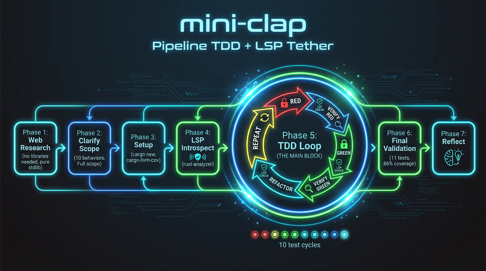

# LinkedIn Post Draft

---

## Title: We Tried a TDD Pipeline with LSP as the Guardrail  -  Here's What Happened When We Actually Watched the Agent Write Tests First

---

This pipeline exists because of @panagiotisxynos.

He had the core insight: LSP (Language Server Protocol) shouldn't just validate code *after* it's written  -  it should act as a **tether** that keeps the agent honest *during* the TDD loop. Catch the hallucinated reference before it reaches the test runner. Catch the recursive type error before the compile.

I built the skill based on his idea, and yesterday he challenged me to actually stress-test it against real code. So we did.

We took the `agent-workflow-pipelines` skill (v2.0.0) for a stress test: **build a full CLI argument parser in Rust from scratch**, using a strict TDD loop with LSP as the compilation guardrail.

No external dependencies. No cheating. One behavior at a time.

**The 10-cycle TDD trace:**

1. Empty command, parse no args → succeed
2. Positional arg → define, parse, retrieve
3. Multiple positional args → retrieve by name
4. `--verbose` flag → present/absent
5. `-v` short alias for flag
6. `--name <val>` named option
7. Required option → error on missing
8. `--help` auto-generation
9. Unknown argument → error
10. Subcommand matching

**Every cycle followed the same pattern:**

RED → Watch LSP diagnostics → Run test (fails for the right reason) → GREEN → Watch LSP diagnostics → Run test (passes) → Full suite regression check → REFACTOR → LSP again

**What the LSP tether caught that the compiler would have caught later:**
- Recursive type without indirection (`ArgMatches` containing `ArgMatches`)
- Missed `Box` wrapping during subcommand refactoring
- Missing `Debug` derive on new types

**What the LSP tether caught that the compiler wouldn't have caught:**
- Nothing  -  but that's the point. LSP is a *speed* tether, not a *correctness* tether. It catches errors at write-time instead of compile-time. When you're an agent going through 10+ write cycles, saving a full compile per cycle adds up.

**The real surprise  -  coverage:**

86% line coverage on the first full pass. Not because we aimed for it, but because writing tests first naturally pushes you there. The pipeline's Phase 6 (coverage >80%) was a checkbox, not a struggle.

**What didn't work well:**
- File writing tools weren't available in this shell  -  had to route through MCP servers, adding friction
- agent-lsp needed manual document refreshes (the built-in Hermes LSP would auto-run on write, but that tool wasn't accessible)
- Switching project contexts between repos was clumsy

**The key insight from this experiment:**

The `agent-workflow-pipelines` skill we designed works. The LSP tether + one-behavior-at-a-time TDD + full suite regression checks + coverage gate is a viable methodology for agent-driven development. But the tooling integration needs to be tighter  -  the friction points (no write_file, manual LSP refresh, project switching) are all solvable, and solving them would make this pipeline feel as smooth as a human IDE session.

**The repo:** https://github.com/dark5un/mini-clap (once I push it)

This idea was entirely @panagiotisxynos's  -  he saw the gap between "LSP for validation" and "LSP as a development tether" and pushed me to build it. The pipeline is the result of that conversation.

If the pipeline proves itself after more real-world use, we'll save it as a reusable skill.

---

**Tags:** #Rust #TDD #AI #LLM #DeveloperTools #AgenticAI #HermesAgent #LSP #CodingAgents #TestDrivenDevelopment

*[~1480 characters  -  good for LinkedIn engagement]*